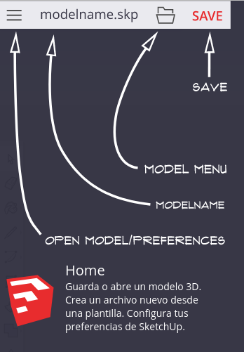
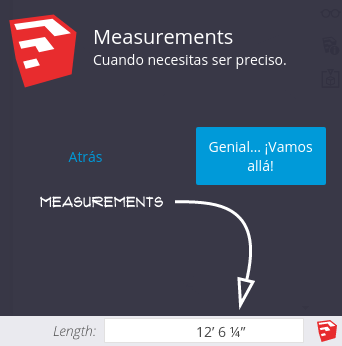
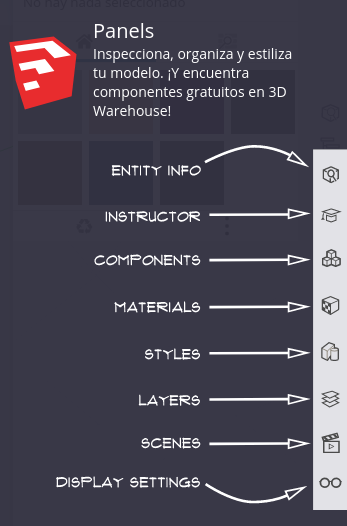
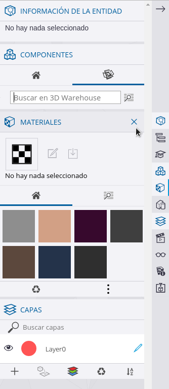
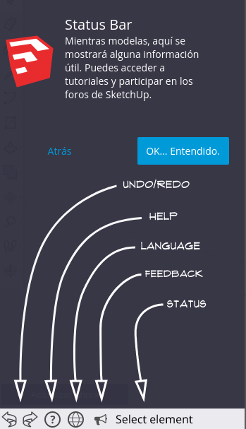
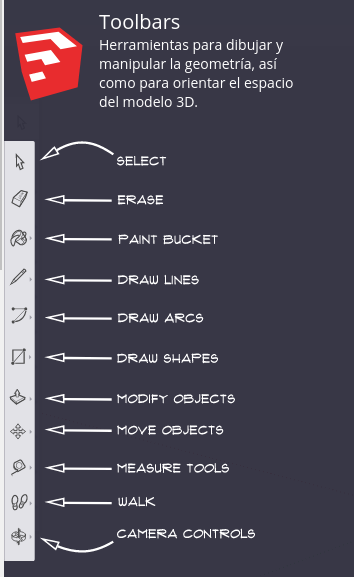
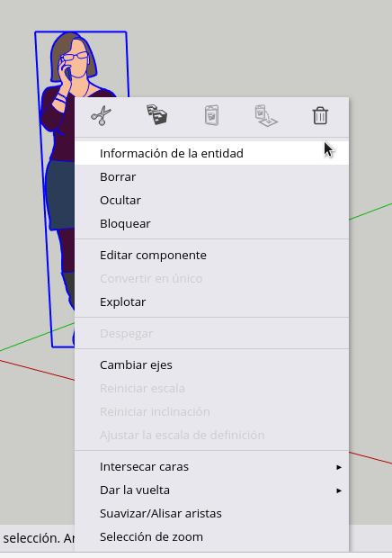
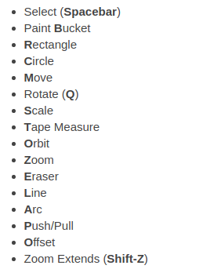

# SOFTWARE Y RECURSOS PARA IMPRESORAS 3D ([191813GE029](https://www.juntadeandalucia.es/educacion/secretariavirtual/consultaCEP/actividad/191813GE029/))

## CEP de Guadix

### José Antonio Vacas @javacasm

## https://github.com/javacasm/3DGuadix2ed

* *  *

# [SketchUp](https://www.sketchup.com/es)

[Video tutoriales](http://www.sketchup.com/es/learn/videos/58?playlist=58)

SketchUp es un producto comercial que tiene una licencia free y Educacional gratuita

Es una herramienta 2D que permite "levantar" los dibujos

### La "mentira" de SketchUp

## https://app.sketchup.com/app?hl=es

1. Creamos cuenta
1. Usaremos la versión free
1. Tour del interface

## Modelo

## Medidas

Podemos indicar las medidas en cm, m, " ...

## Paneles

## Rehacer / Deshacer

## Herramientas

## Opciones de un objeto

### Rotación de los ejes y zoom

### Trabajo con objetos sencillos

Seleccionamos un objeto, por ejemplo a Helen, o mejor ... (Warehouse...)

* Redimensionar
* Rotar
* Propiedades

### Crear casita

1. Base
1. Volumen
1. Escalones
1. Puerta
1. Ventanas huecas
1. Levantar Tejado
1. Añadir chimenea

### Medidas

1. Añadir cotas
1. Redimensionar
  1. ¡¡Cuidado con los ángulos!!

### Atajos de teclado

Spacebar – Select tool
R – Rectangle tool
L – Line tool
M – Move tool
P – Push/pull tool
S – Scale tool
Q – Rotate tool (This is one with a weird letter. But I remember it because the letter Q is round, and has a “handle” on it. So you could grab the handle and rotate it around 😉 )
E – Eraser tool
G – Make Component (See below, I created a custom shortcut SHIFT + G to make group)
Arrow keys – Lock axis

### Versión de la aplicación

* Aceptamos la licencia
* Seleccionamos una plantilla: unidades y vista
* Interface
  * Podemos seleccionar la vista (desde cámara)
  * A la derecha tenemos el instructor que nos va ayudando a aprender
  * Multitud de barras de herramientas (que pueden flotar).
    * Primeros pasos
    * Conjunto grande de herramientas
  * Al dibujar hay puntos "selectos" que nos capturan el ratón (centro, esquinas, etc) y
  * Direcciones especiales (ejes y paralelas) que se muestran con colores distintos. Podemos indicar la guía sin más que tocar el punto (ejemplo de línea hasta la mitad o paralela a otra)
  * Herramienta Push/Pull
  * Podemos usar las herramientas "Orbitar" (Clic sobre la rueda del raton), "Desplazar" y "Zoom" (Rueda del raton) (Siempre podemos volver a vistas)
  * Podemos dividir una cara sin más que añadir una arista y podemos desplazar la aristas con la herramienta "Mover", que nos permite mover vértices, aristas y caras
  * Herramienta de goma, muy pontente. Si borramos caras de arriba veremos porqué decimos que es una herramienta 2D
  * Herramienta de offset (y follow me)
  * Podemos crear objetos de medidas exactas usando las cantidades (separadas por ;)
  * Podemos trabajar fuera o dentro de nuestro modelo
  * Añadimos guías
  * Podemos añadir colores o texturas
  * 3D Warehouse

# Tareas

* Dibujar una casita
* Añadir una chimenea "a mano" (3 formas de hacerlo)
* Añadir una escalera de entrada
* Hacer zócalos
* Añadir mobiliario

[Diseñar para imprimir con SketchUp](https://i.materialise.com/blog/3d-printing-with-sketchup/)
